# Documentación Técnica — Configuración FortiGate
**Estudiante:** Junior Javier Santos Perez  
**Matrícula:** 2024-1599  
**Plataforma:** PnetLab  
**Dispositivo:** FortiGate-VM64-KVM v7.0.3  
Enlace video demostrativo: https://www.youtube.com/watch?v=pGFLhmqt7_E

---

## Objetivo de la Red

Implementar una topología de red segura utilizando FortiGate como dispositivo central, configurado completamente desde la GUI, que proporcione:

- Acceso a Internet con NAT para la LAN de usuarios
- Segmentación de red entre usuarios y servidores
- Control de acceso estricto: solo HTTP desde usuarios hacia servidores
- Bloqueo de redes sociales, WhatsApp, y dominios específicos
- Detección y bloqueo de escaners de red
- Protección WAF al servidor web Apache

---

## Topología

```
              [Internet / Nube - Net]
                       |
                    port1
              192.168.129.150/24 (WAN)
                  [FortiGate-1]
              port2          port3
                |                |
          [SW-Usuarios]    [SW-Servidores]
          /          \           |
    [VPC3]       [Linux-cliente]  [Linux-Servidor]
  10.15.99.2      10.15.99.3    192.168.99.2
  LAN-Usuarios (/25)            LAN-Servidores (/28)
```

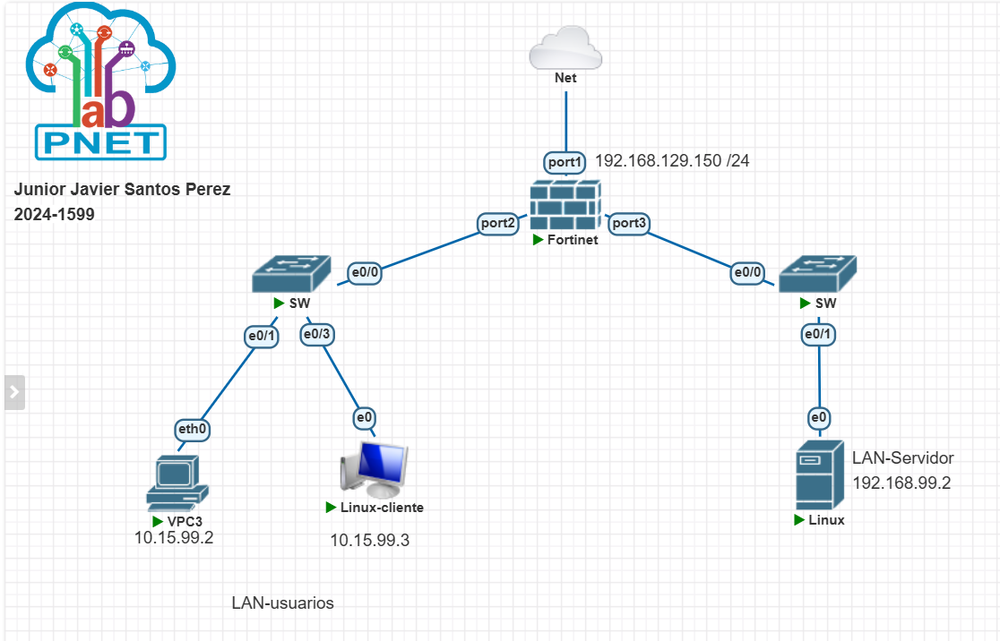

**IMAGEN2** — Vista de la topología completa en PnetLab

---

## Direccionamiento IP

| Dispositivo | Interfaz | IP / Máscara | Rol |
|---|---|---|---|
| FortiGate | port1 | 192.168.129.150/24 | WAN — salida a Internet |
| FortiGate | port2 | 10.15.99.1/255.255.255.128 | LAN Usuarios (/25) |
| FortiGate | port3 | 192.168.99.1/255.255.255.240 | LAN Servidores (/28) |
| VPC3 | eth0 | 10.15.99.2/25 | Cliente usuario 1 |
| Linux-cliente | eth0 | 10.15.99.3/25 | Cliente usuario 2 (Kali) |
| Linux-Servidor | eth0 | 192.168.99.2/24 | Servidor Web Apache |

### Cálculo de subredes

| Red | Máscara | Hosts disponibles | Rango útil |
|---|---|---|---|
| 10.15.99.0/25 | 255.255.255.128 | 126 hosts | .2 — .126 |
| 192.168.99.0/28 | 255.255.255.240 | 14 hosts | .2 — .14 |

---

## Configuraciones Aplicadas

---

### 1. Dashboard — Estado del Sistema
`Dashboard → Status`

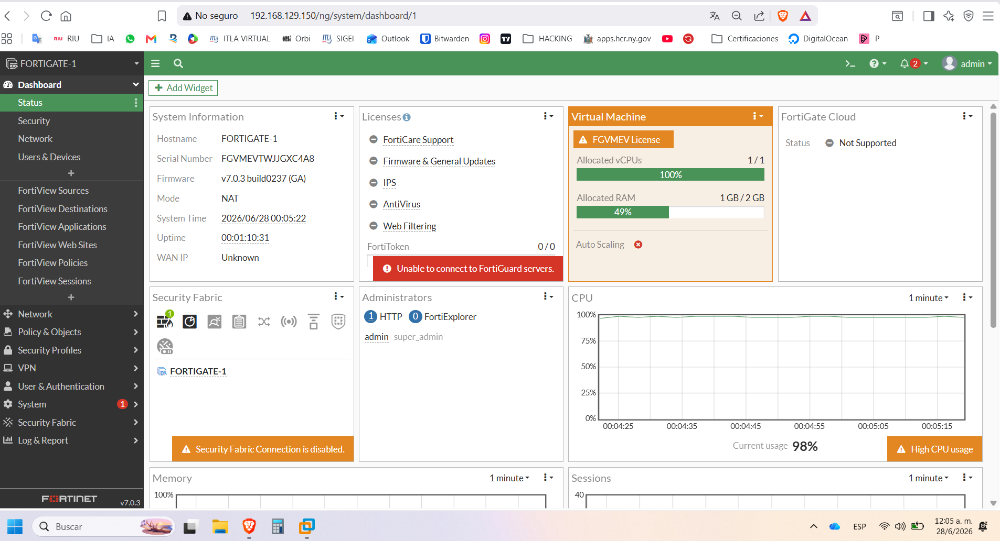

**IMAGEN1** — Vista del dashboard de FortiGate mostrando información del sistema, licencias y estado general. Se observa el hostname FORTIGATE-1, firmware v7.0.3 y la advertencia de licencia de evaluación (FGVMEV).

> El FortiGate opera en modo NAT. La licencia es de evaluación, lo que limita algunas funciones de FortiGuard en tiempo real, pero toda la configuración es válida para producción con licencia activa.

---

### 2. Interfaces de Red
`Network → Interfaces`

#### port1 — WAN
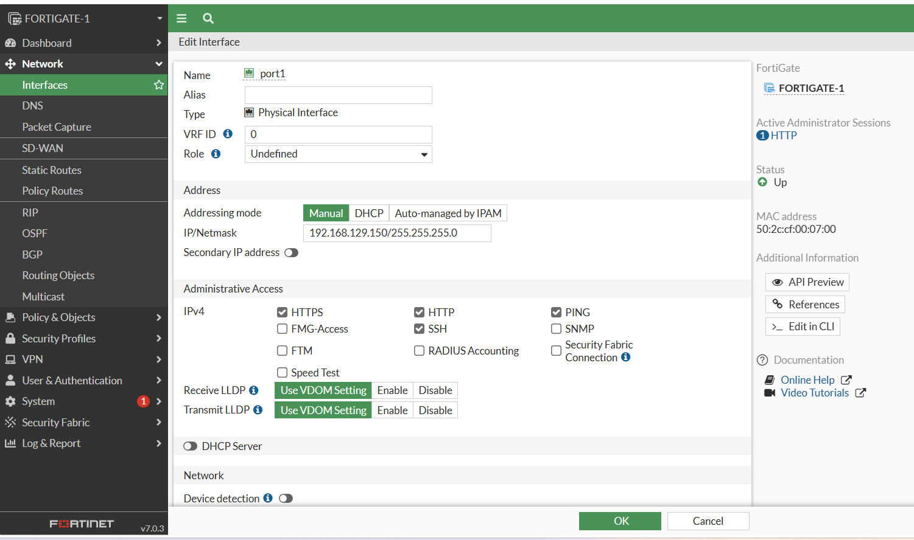

**IMAGEN3** — Configuración de port1 como interfaz WAN con IP estática 192.168.129.150/24. Permite acceso HTTPS, HTTP, PING y SSH para administración.

#### port2 — LAN Usuarios
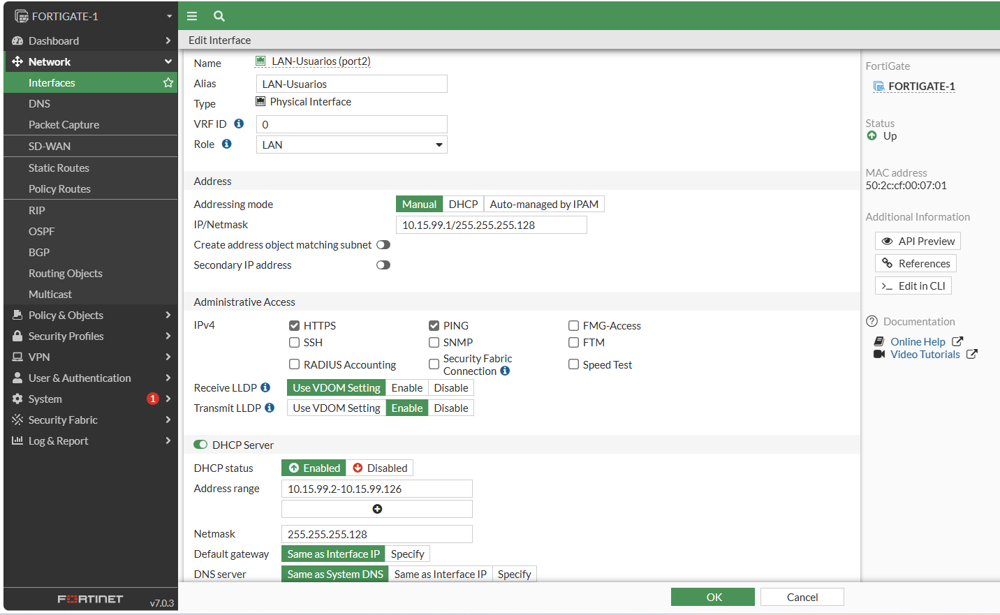

**IMAGEN4** — Configuración de port2 con alias LAN-Usuarios, IP 10.15.99.1/255.255.255.128 (red /25), Role LAN. DHCP Server habilitado con rango 10.15.99.2 — 10.15.99.126, gateway automático y DNS del sistema.

> Una red /25 proporciona 126 hosts utilizables, suficiente para una LAN de usuarios mediana.

#### port3 — LAN Servidores
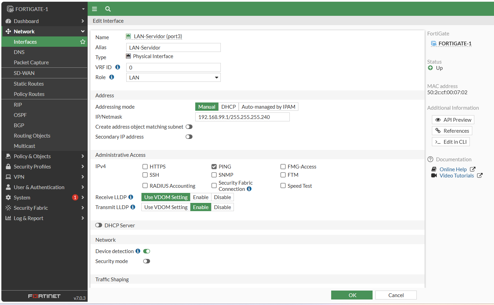

**IMAGEN5** — Configuración de port3 con alias LAN-Servidor, IP 192.168.99.1/255.255.255.240 (red /28), Role LAN. Sin DHCP porque los servidores usan IP fija para ser siempre localizables.

> Una red /28 proporciona 14 hosts utilizables, adecuada para una LAN de servidores pequeña.

---

### 3. Ruta por Defecto
`Network → Static Routes`

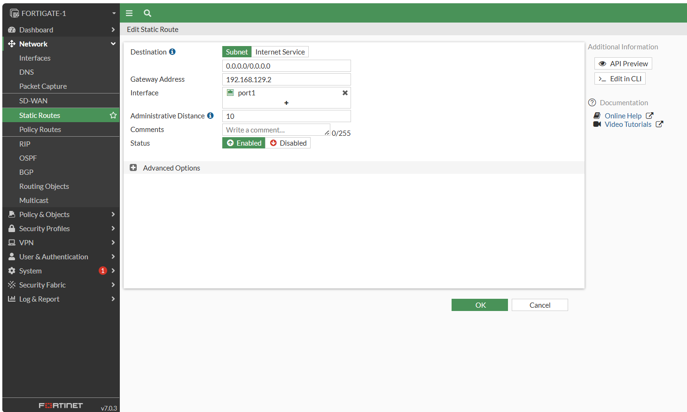

**IMAGEN6** — Ruta estática 0.0.0.0/0.0.0.0 apuntando al gateway 192.168.129.2 por port1, distancia administrativa 10.

> La ruta por defecto le indica al FortiGate que todo tráfico con destino desconocido debe salir por port1 hacia Internet. Sin esta ruta, ningún usuario tendría acceso a Internet.

---

### 4. Políticas de Firewall
`Policy & Objects → Firewall Policy`

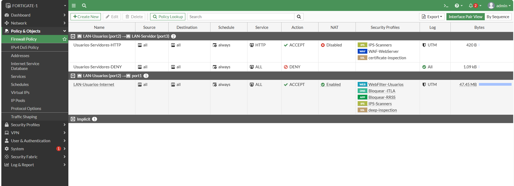

**IMAGEN7** — Vista general de todas las políticas en orden de ejecución.

> FortiGate bloquea TODO el tráfico por defecto. Solo pasa lo que una política ACCEPT permite. Las políticas se leen de arriba hacia abajo; la primera que coincide con el tráfico gana.

#### Política 1 — Usuarios → Servidores (Solo HTTP)
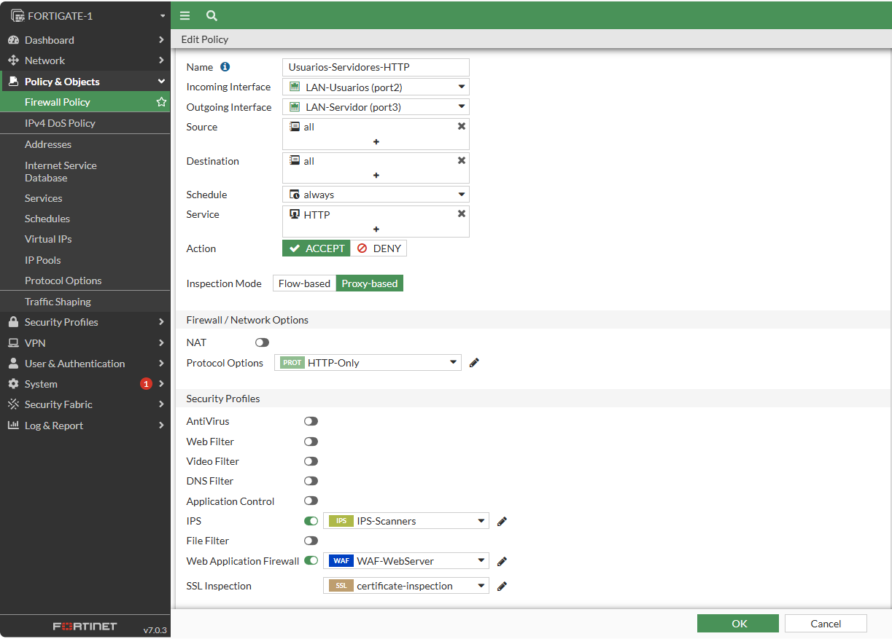

**IMAGEN8** — Política Usuarios-Servidores-HTTP: entrada port2, salida port3, servicio HTTP únicamente, acción ACCEPT, NAT deshabilitado, Inspection Mode Proxy-based, con perfiles IPS-Scanners y WAF-WebServer aplicados.

> Solo el puerto 80 (HTTP) tiene permiso de pasar de la LAN de usuarios a la LAN de servidores. HTTPS, FTP, ICMP y cualquier otro protocolo es rechazado por la siguiente regla.

#### Política 2 — Usuarios → Servidores (DENY todo lo demás)
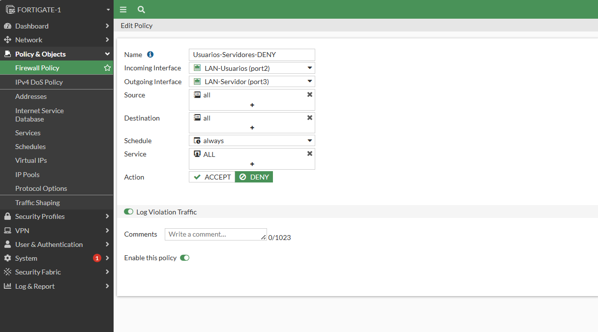

**IMAGEN9** — Política Usuarios-Servidores-DENY: entrada port2, salida port3, servicio ALL, acción DENY, Log Violation Traffic habilitado.

> Esta regla captura todo el tráfico que no fue permitido por la regla HTTP anterior y lo bloquea. El log registra cada intento bloqueado para auditoría.

#### Política 3 — LAN Usuarios → Internet (con NAT)
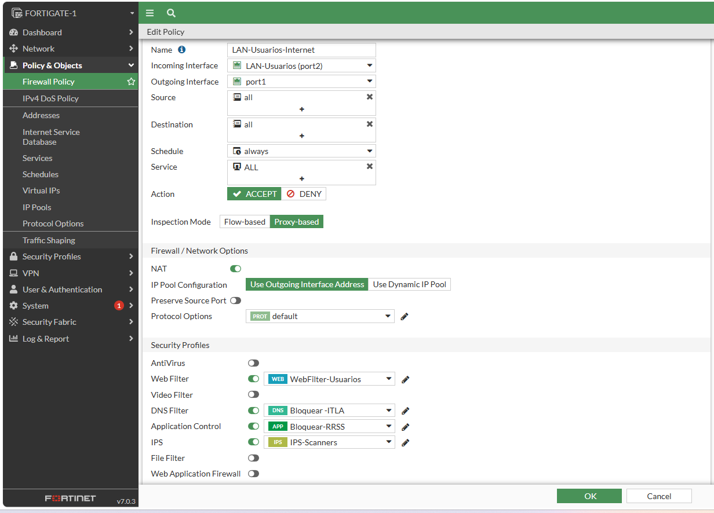

**IMAGEN10** — Política LAN-Usuarios-Internet: entrada port2, salida port1, servicio ALL, acción ACCEPT, NAT habilitado con IP de interfaz de salida, Inspection Mode Proxy-based, con perfiles WebFilter-Usuarios, DNS Bloquear-ITLA, App Control Bloquear-RRSS, IPS-Scanners y deep-inspection aplicados.

> El NAT traduce las IPs privadas (10.15.99.x) a la IP pública de port1 (192.168.129.150) para que los usuarios puedan salir a Internet. Sin NAT, los paquetes saldrían con IP privada y nadie en Internet sabría cómo responder.

---

### 5. Bloqueo de Redes Sociales y WhatsApp
`Security Profiles → Application Control → Bloquear-RRSS`

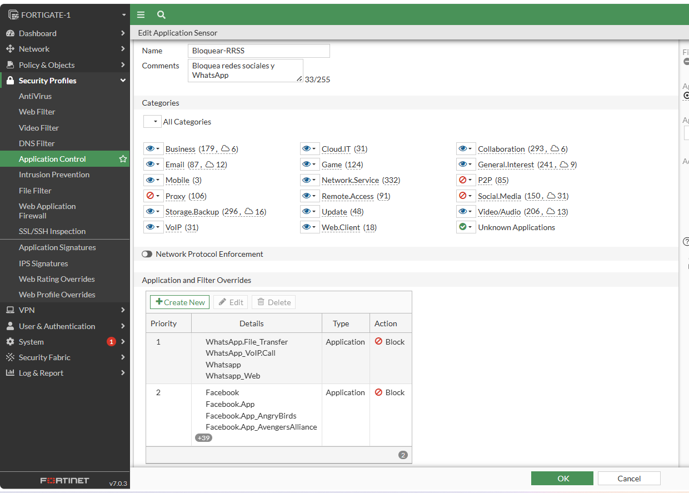

**IMAGEN13** — Perfil de Application Control con categoría Social.Media en Block y overrides específicos para todas las aplicaciones de WhatsApp bloqueadas.

> Application Control identifica aplicaciones por su comportamiento y firmas de tráfico, no solo por el puerto. Facebook, Instagram y TikTok usan HTTPS igual que cualquier web, pero FortiGate los distingue y bloquea.

**Aplicaciones WhatsApp bloqueadas:**
- WhatsApp.File_Transfer — transferencia de archivos
- WhatsApp_VoIP.Call — llamadas de voz y video
- Whatsapp — aplicación general
- Whatsapp_Web — WhatsApp desde navegador

**Categorías bloqueadas:**
- Social.Media (150 aplicaciones)
- P2P (85 aplicaciones)
- Proxy (106 aplicaciones)

---

### 6. Bloqueo de itla.edu.do
`Security Profiles → DNS Filter → Bloquear-ITLA`  
`Security Profiles → Web Filter → WebFilter-Usuarios`

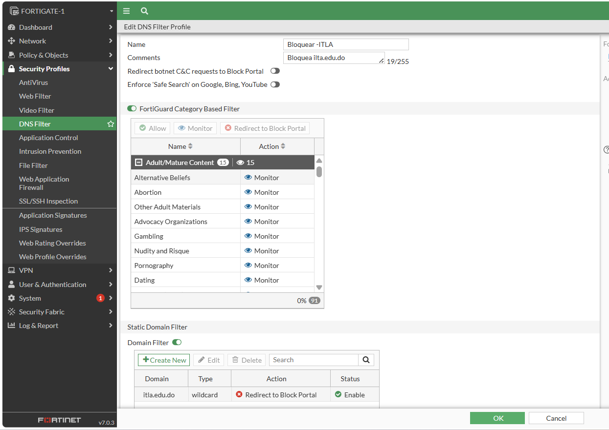

**IMAGEN12** — Perfil DNS Filter con dominio itla.edu.do configurado como Wildcard con acción Redirect to Block Portal. Bloquea itla.edu.do y todos sus subdominios a nivel DNS.

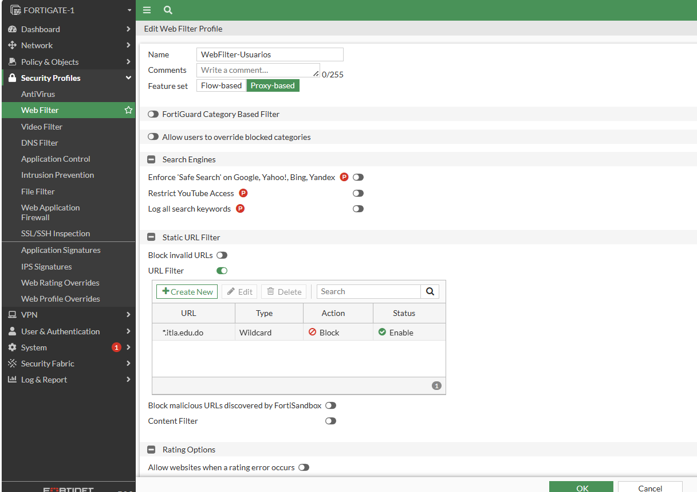

**IMAGEN11** — Perfil Web Filter con URL Filter habilitado, entrada *.itla.edu.do tipo Wildcard con acción Block. Segunda capa de protección a nivel de URL.

> Se utilizan dos métodos combinados para garantizar el bloqueo:
> - DNS Filter intercepta la consulta DNS antes de que se resuelva la IP
> - Web Filter bloquea la URL directamente como segunda capa
> - El Wildcard *.itla.edu.do cubre: www.itla.edu.do, moodle.itla.edu.do, virtual.itla.edu.do, y cualquier subdominio

---

### 7. Detección y Bloqueo de Escaners de Red
`Security Profiles → Intrusion Prevention → IPS-Scanners`

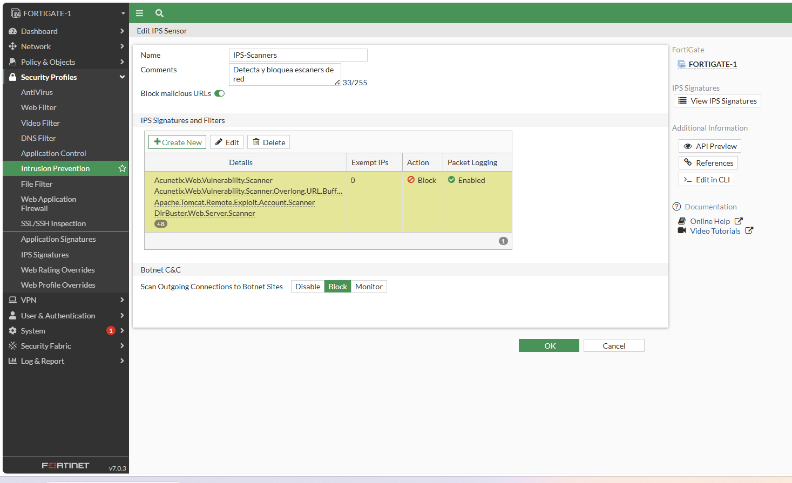

**IMAGEN14** — Perfil IPS con 12 firmas de escaners de red configuradas en Block con Packet Logging habilitado. Botnet C&C configurado en Block. Block malicious URLs activado.

> Los escaners de red como Nmap, Acunetix y DirBuster intentan descubrir puertos y servicios abiertos para encontrar vulnerabilidades. El IPS detecta estos patrones de tráfico y los bloquea antes de que el atacante obtenga información útil.

**Firmas incluidas:**
- Acunetix.Web.Vulnerability.Scanner
- Acunetix.Web.Vulnerability.Scanner.Overlong.URL.Buffer.Overflow
- Apache.Tomcat.Remote.Exploit.Account.Scanner
- DirBuster.Web.Server.Scanner
- +8 firmas adicionales de escaners

---

### 8. WAF — Protección del Servidor Web
`Security Profiles → Web Application Firewall → WAF-WebServer`

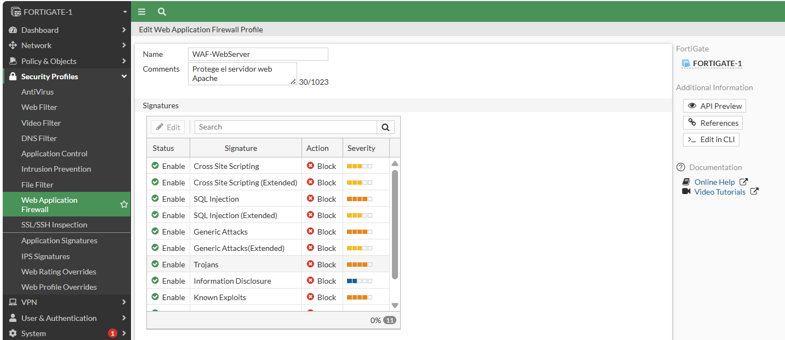

**IMAGEN15** — Perfil WAF con todas las firmas de ataque habilitadas en Block: Cross Site Scripting, SQL Injection, Generic Attacks, Trojans, Information Disclosure, Known Exploits y más.

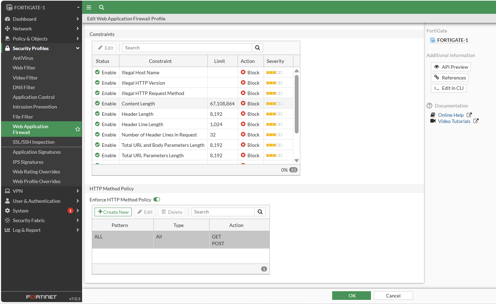

**IMAGEN16** — Sección de Constraints del WAF con 13 restricciones habilitadas (Illegal Host Name, Illegal HTTP Version, Content Length, Header Length, etc.) y HTTP Method Policy limitando solo métodos GET y POST.

> El WAF inspecciona cada petición HTTP que llega al servidor Apache y bloquea las que contienen patrones de ataque conocidos:
> - SQL Injection: evita robo de datos de la base de datos
> - XSS: evita inyección de código JavaScript malicioso
> - Bad Robot: bloquea bots y herramientas de reconocimiento
> - Known Exploits: bloquea exploits conocidos contra Apache

---

## Pruebas de Verificación

### VPC3 recibe IP por DHCP
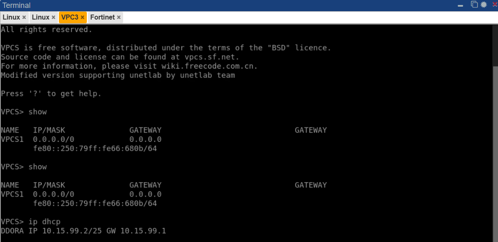

**IMAGEN17** — VPC3 ejecuta `ip dhcp` y obtiene IP 10.15.99.2/25 con gateway 10.15.99.1, confirmando que el servidor DHCP en port2 funciona correctamente.

### Ping bloqueado desde VPC3 al servidor
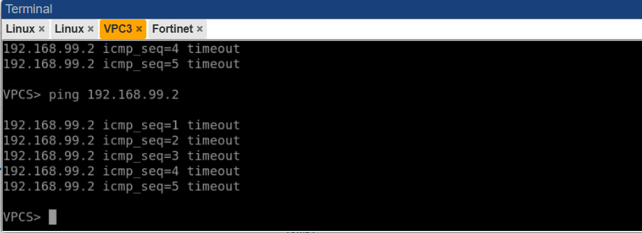

**IMAGEN18** — VPC3 intenta ping a 192.168.99.2 y recibe timeout en todos los paquetes. Esto confirma que la política DENY está funcionando: ICMP no es HTTP, por lo tanto es bloqueado.

### Servidor Linux con IP estática correcta
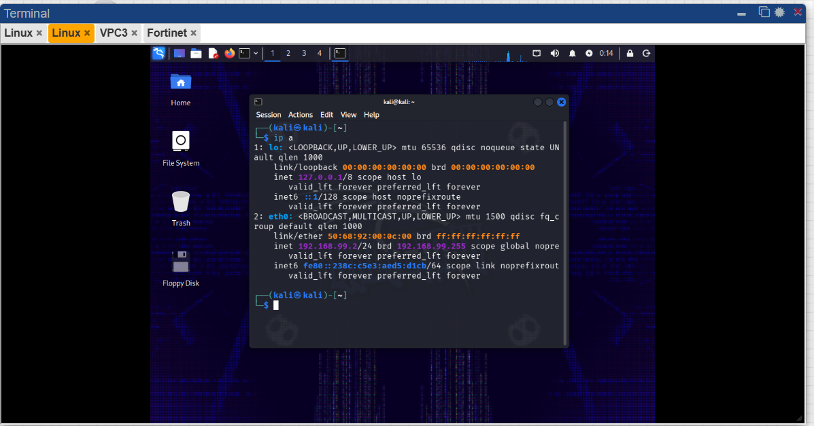

**IMAGEN19** — Linux servidor (Kali) muestra IP 192.168.99.2/24 en interfaz eth0, confirmando que está correctamente ubicado en la LAN de servidores.

### itla.edu.do bloqueado exitosamente
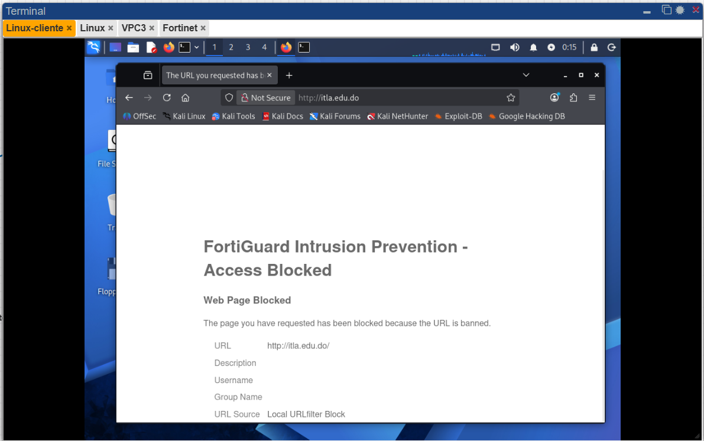

**IMAGEN20** — Linux-cliente intenta acceder a http://itla.edu.do y recibe la página de bloqueo de FortiGuard: "FortiGuard Intrusion Prevention - Access Blocked. The page you have requested has been blocked because the URL is banned. URL Source: Local URLfilter Block". Confirma que el Web Filter está funcionando correctamente.

---

## Resumen de Políticas

| Política | Entrada | Salida | Servicio | Acción | NAT |
|---|---|---|---|---|---|
| Usuarios-Servidores-HTTP | port2 | port3 | HTTP | ACCEPT | No |
| Usuarios-Servidores-DENY | port2 | port3 | ALL | DENY | No |
| LAN-Usuarios-Internet | port2 | port1 | ALL | ACCEPT | Sí |

## Resumen de Perfiles de Seguridad

| Perfil | Tipo | Protege contra | Aplicado en |
|---|---|---|---|
| Bloquear-RRSS | Application Control | Redes sociales, WhatsApp | LAN-Usuarios-Internet |
| Bloquear-ITLA | DNS Filter | Consultas DNS a itla.edu.do | LAN-Usuarios-Internet |
| WebFilter-Usuarios | Web Filter | URLs de itla.edu.do | LAN-Usuarios-Internet |
| IPS-Scanners | Intrusion Prevention | Escaners de red, Botnet | Ambas políticas ACCEPT |
| WAF-WebServer | Web Application Firewall | SQLi, XSS, exploits web | Usuarios-Servidores-HTTP |

---

## Nota sobre Licencias

Esta implementación fue realizada en un entorno de laboratorio (PnetLab) con licencia de evaluación FGVMEV. En un entorno de producción con licencia FortiGuard activa, las funcionalidades de Application Control para redes sociales y la categorización dinámica de URLs funcionarían en tiempo real con actualizaciones diarias de firmas.

Toda la configuración mostrada es válida y aplicable en producción.
